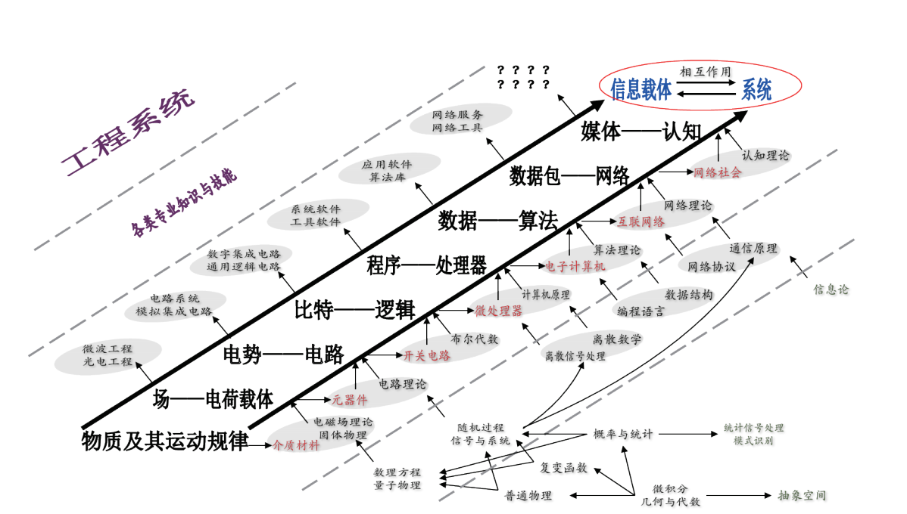

# 电子信息类

## 电子工程系

> [清华大学电子工程系官网](https://www.ee.tsinghua.edu.cn/)

电子工程系始建于 1952 年，最初叫无线电工程系，现在简称“无系”。每届本科生大概有 250 人。本科阶段不分流。

电子工程系的本科生专业方向是**电子信息科学与技术**。

电子信息科学与技术以数学和物理为基础，深入研究信息载体与信息处理系统的基本规律，以及二者之间的相互作用关系。从**微电子及光电子器件的设计制造**到**通信**、**雷达**、**人工智能**等复杂信息系统的构建，电子信息科学技术已经全面渗透到医疗健康、交通运输、能源环境等各个领域。

### 学科体系
主要建设两个一级学科，共同建设一个一级学科。

- **电子科学与技术**
    - 物理电子学与光电子学
    - 电路与系统
    - 电磁场与微波技术
- **信息与通信工程**
    - 通信与信号系统
    - 智能信号与信号处理
    - 复杂系统与网络
- **集成电路科学与工程**
    - 集成纳电子科学
    - 集成电路设计与设计自动化

### 课程体系
基于知识体系，电子系构建了**十门专业核心课**。

- 计算机程序设计
- 电子电路与系统基础
- 数据与算法
- 数字逻辑与处理器基础
- 电磁场与波
- 信号与系统
- 概率论与随机过程
- 通信与网络
- 媒体与认知
- 固体物理

### 个人感受

> 电子工程系课程覆盖方向较多，知识密度较大，对物理要求很高。~~据说是清华最难工科~~
>
> 本科阶段不分流导致在各个方向难以学精。~~不读研等于白学四年~~
>
> ~~电子工程系的老师教学特点鲜明，电子工程系的学生精神状态良好。~~